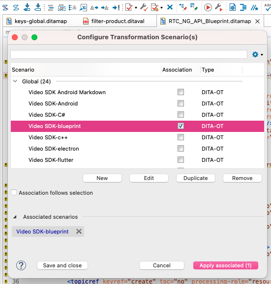

# Way of Working

Documentation is a crucial part of Agora's offering to customers. This document describes how the EN doc team
plans and carries out documentation activities to make sure that everything on Agora's
[documentation website](docs.agora.io) is up to standard and released in a timely manner.

## EN doc team structure

Currently, the EN doc team includes the following roles and members:

* Technical Writer Lead: [Saud](https://github.com/saudsami)
* Editor/Project Manager: [Anastasia](https://github.com/atovpeko)
* Technical Writers: [Dasun](https://github.com/nirm2009), [Hussain](https://github.com/hussain-khalid), [Pankaj](https://github.com/Pankajg123), and [Kishan](https://github.com/Kishan-Dhakan).

## Documentation work lifecycle

Working on documentation includes the following stages:

1. Documentation request
2. Project planning and management
3. Writing
4. Review
5. Publishing

### Prerequisites

Agora uses [Docusaurus](https://docusaurus.io/) to generate a static documentation website.
To be able to contribute to Agora documentation, follow [this procedure](https://github.com/AgoraIO/Docs/edit/staging/README.md)
and then clone [all other repositories](#repositories) that the EN doc team works in.

To set up your development environment, refer to the prerequisites section of the SDK quickstart for the relevant product and platform. For example, you can find Video Calling prerequisites for Android development [here](https://docs.agora.io/en/realtime-communication/get-started/get-started-sdk?platform=android#prerequisites).

### 1. Documentation request

The need to deliver new or update the existing documentation may arise from requests from product or development teams, customer feedback on documentation, or internal
documentation analysis. In case of new product releases, the SDK to be released is first tested and approved by the DevRel team. Only after an official approval the TW team starts 
documentation work.

//Insert a matrix of stakeholders (PMs, devs, etc.) with the products/areas they are responsible for.

### 2. Project planning and management

The TW Lead and Editor analyze the documentation request and plan and assign the work in the form of milestones and related issues. 

#### Milestones

The doc team uses GitHub [milestones](https://docs.github.com/en/issues/using-labels-and-milestones-to-track-work/about-milestones)
to plan, track, and deliver documentation. A milestone represents the full list of documentation issues
associated with a certain project.

Milestone examples include:

* A new release of an existing Agora product. For example, release of Signaling v1.6.0.
* A new release of an existing Agora product for certain platforms only. For example, release of Video SDK v4.1.1 for web.
* A new Agora product release.
* Documentation improvements. For example, fixing broken links or aligning pricing pages across all docs.
* Generally, any combination of activities that would serve a single purpose.

#### Issues

After a milestone is created, the TW Lead and Editor create issues for each smaller documentation task using
the following logic:

* The milestone is broken down into issues based on individual documents that need to be created or updated.
* For new documents or a complete document rewrite, create a separate issue for each platform.
* For minor updates that span multiple platforms or multiple documents, create a single issue with subtasks for each platform or document.

#### Branches

The milestone creator also creates a milestone branch from the `staging` branch and specifies it in the milestone description.
It usually follows this naming convention:

`milestone-<number>-<milestone_name>`

For example, `milestone-45-video-sdk-4.1.1-native`.

//Specify how long we need to keep milestones after they are merged.

TWs create branches for their assigned issues from
the milestone branch and raise PRs back into it. Issue branches usually follow this naming convention:

`<issue_number>-<doc_type>_<platform>`

For example, `1064-quickstart-android`. 

When all the issue branches in a milestone are merged, the milestone branch is merged as follows: 

* For a product that is GA, the milestone branch is merged to `staging`.
* For a product in beta, the milestone branch is merged to `beta`.

//Clarify how and when it goes to `main`.

#### Repositories

The [Docs](https://github.com/AgoraIO/Docs.git) repository contains the basic website framework. Only issues that require addition or modification of products, product platforms, product availability, API reference links, SDK links should be created in this repository. It has the following submodules:

* [Doc-Source-Private](https://github.com/AgoraIO/Doc-Source-Private/)
   
   This repository contains documentation content for various products and platforms. Most new milestones and documentation issues are created in this repository. It replaces the [Docs-Source](https://github.com/AgoraIO/Docs-Source/) public repository that is currently being phased out. 

* [Docs-Source](https://github.com/AgoraIO/Docs-Source/) 

    This is a public repository where non-TWs without access to the private one can still open documentation requests.  

* [Docs-Source-Legacy](https://github.com/AgoraIO/Docs-Source-Legacy)

   Contains legacy documents for older product versions.

* [Docs-Help](https://github.com/AgoraIO/Docs-Help)

   Contains documents under the Help menu.

#### Assignment

Issues in a milestone are assigned to TWs depending on their areas of responsibility and rotation.

Every platform has a primary writer and a backup writer who is assigned the ticket if the primary writer is unavailable.
The backup writer also acts as a primary reviewer.

Backup writers change their platform every quarter.

| Platform                                        | Primary writer                               | Backup writer/Primary reviewer               |
|-------------------------------------------------|----------------------------------------------|----------------------------------------------|
| Android                                         | [Saud](https://github.com/saudsami)          | TBC                                          |
| Flutter                                         | [Saud](https://github.com/saudsami)          | TBC                                          |
| iOS                                             | [Dasun](https://github.com/nirm2009)         | [Iain](https://github.com/billy-the-fish)    |
| macOS                                           | [Dasun](https://github.com/nirm2009)         | [Iain](https://github.com/billy-the-fish)    |
| Unity                                           | [Hussain](https://github.com/hussain-khalid) | TBC                                          |
| Windows C++                                     | [Pankaj](https://github.com/Pankajg123)      | [Hussain](https://github.com/hussain-khalid) |     
| Windows C#                                      | [Pankaj](https://github.com/Pankajg123)      | [Hussain](https://github.com/hussain-khalid) |
| Web                                             | [Kishan](https://github.com/Kishan-Dhakan)   | [Hussain](https://github.com/hussain-khalid) | 
| Electron                                        | [Kishan](https://github.com/Kishan-Dhakan)   ||
| React Native                                    | [Hussain](https://github.com/hussain-khalid) | [Kishan](https://github.com/Kishan-Dhakan)  |
| Linux Java                                      | [Saud](https://github.com/)                                          | TBC                                          |
| Linux C++                                       | [Pankaj](https://github.com/Pankajg123)                                          | TBC                                          |
| General improvement tickets                     | Every TW in turn                             | Every TW in turn                             |                |
| Release notes, API reference, and SDK downloads | [Anastasia](https://github.com/atovpeko)     | [Dasun](https://github.com/nirm2009)         |

After a milestone is created, it is sent to the responsible PO for approval. Once the milestone is approved, the documentation work starts. 

### Writing

All Agora documentation is written in a clear, consistent American English,
following [Google developer documentation style guide](https://developers.google.com/style).

For issues that require technical implementation, the doc team follows this process:

1. The TW Lead develops implementation for their platform
1. The TW Lead raises a PR, and requests a review from the Editor.
1. Once all possible comments have been addressed and technical/language review is passed, the TW Lead passes
   their implementation to other TWs.
1. TWs adapt the implementation for their respective platforms.

For issues that do not require technical implementation, TWs use their judgement or input from dev teams or other SMEs.

For API reference, if the HTML files are not provided by SMEs, the TWs follow this procedure to generate them:

//Clarify the procedure and criteria for when the HTML files have to be re-generated.

#### Minimal scope for documenting releases

Some product releases do not require any major doc updates and only include the following:

- Release notes
- New SDK download link
- New API html or even just a bump in the API version

To document such releases:

1. Create 3 milestone branches with the same name in Docs, Docs-Source-Private, and API-Reference repositories following the naming convention above. 

1. Create an update branch under the same name from each of those milestone branches. 

1. Update the release notes using the input provided by the CN team in Docs-Source-Private. Raise the PR back to the Docs-Source-Private milestone branch.

1. Update the API reference with the zip(s) provided by the CN team in the API-Reference branch. If no zip is provided, find and replace the API version so that it is consistent with the release. Raise the PR back to the API-Reference milestone branch.

1. Update `data/api-reference.js` with the latest version number and `data/sdks.js` with the new SDK download link in the Docs branch. Raise the PR back to the Docs milestone branch.

1. Make sure all open PRs are linked to your ticket for better organization and easier review. 

### Review

The review stage includes self-review, team review, and PM review, if needed.

#### Self-review

Before raising a PR, every TW does a self-review in the local build:

* Build the docs site using `yarn start` to ensure that there are no build errors.
* Follow the procedure in the document step by step. Copy/paste code from the built site to check that the code still works as intended.
* Read the document from top to bottom and then bottom up to fix any language or technical issues.
* Click through all links to identify and fix any broken links.

//Clarify the procedure with `yarn start`/`yarn build`/`yarn clear`

#### Team review

Each TW raises a PR and requests reviews following this logic:

| Review type  | Reviewer                                                                                                                                                           | Mandatory or optional                                       |
|--------------|--------------------------------------------------------------------------------------------------------------------------------------------------------------------|-------------------------------------------------------------|
| Language     | Editor                                                                                                                                                             | Mandatory                                                   |
| Code testing | The Primary writer requests a code review from the backup writer for their platform. | Mandatory for issues that require technical implementation  |
| Technical    | Lead TW | Mandatory for issues that require technical implementation | 

#### Stakeholder review

[Vercel](https://vercel.com/agora-gdxe) is used for creating a staging instance so that the responsible PMs and SMEs can review and comment on doc updates before they are published. Access to Vercel is required to be able to create such an instance. This review stage includes the following steps:

1. Create the initial instance for review

   Vercel creates an instance automatically for every branch pushed to the following doc-related repositories and then rebuilds it every time additional updates are pushed to it:

   - [Docs repository](https://github.com/AgoraIO/Docs)
   - [API-Reference](https://github.com/AgoraIO/API-Reference)

   For Docs repository: Because most non-API updates are made in the submodules Docs-Source or Doc-Source-Private, and not in the Docs repo itself, some extra steps are required: 

    1. Create and checkout a branch in Docs with the same name as the branch containing doc updates in Docs-Source or Doc-Source-Private.
    1. Make sure the `.gitmodules` file in Docs points to the correct docs submodule. Change if necessary. 
    1. Make sure the docs submodule is on the branch containing your updates. 
    1. In the Docs repo, commit and push the docs submodule.
    
    Your branch has now appeared in Vercel/docs-staging and the build is in the process. It usually takes a couple of minutes for the docs to build. 

   For API-Reference repository: Add `dir.html` to the instance link generated by Vercel. Otherwise, there is a redirect to the actual doc site.  

1. Share the staging instance with stakeholders. 

    1. Follow the staging instance URL provided in Vercel and log in. 
    1. Click on the share icon in the popup Vercel menu and select **Anyone with the link**. 
    1. Copy the URL and email it to reviewers with the default password `@gora_dev`.

1. Make updates per comments. 

   The reviewers log in and leave comments using the Vercel commenting tool.  
   
    1. To see all comments, click on the comment icon in the Vercel popup menu at the bottom. You can filter them by page and resolved/unresolved status. 
    1. Make updates per comments, where appropriate. Commit and push your updates in the docs submodule, then commit and push the docs submodule in the Docs repo. Vercel rebuilds the instance. 
    1. Reply to ALL comments in Vercel. Resolve comment threads that have been implemented and ask for additional input or provide suggestions in others. 
    1. Email the reviewers to let them know the staging instance has been updated and is again ready for review.
    1. Repeat steps 1-4 for all new and unresolved comments until the reviewers give their explicit consent to publish the docs. 

### Publishing

Publishing docs involves building locally and using Vercel to double-check doc updates while moving them all the way from a 
milestone (if any) branch to main.

#### Generating the API refs

The source for the API refs is generated from the ditamaps stored in https://github.com/AgoraIO/agora_doc_source/tree/master/en-US/dita/RTC-NG.  The CN team is responsible for the content written 
about each method and class, and the EN team is responsible for the structure in the EN ditamap files. To 
generate these docs you need an instance of OxygenXML Author v23.1. My preference is to add the Oxygen plugin to 
Eclipse. For a license, ask Chen Meng. 

In general, for each build you make a local branch of the repo from the 
release tag supplied by the cn team, use the github diff to see the changes in the [cn ditamaps](https://github.com/AgoraIO/agora_doc_source/tree/master/dita/RTC-NG) and make similar updates to the en ditamaps. Be careful, the 
ditamap structure is not the same, you see which methods have been added to the cn ditamaps, then add them to the 
correct class or interface in the en ditamaps.   

To generate the EN API references:

1. Note the branch of the last EN docs you made, for example: `v4.2.1-en`.  At the time of writing, the last branch 
   is `unreal-api-4.2.1--en`.
2. In your IDE of choice:
    1. Check out the CN updates in https://github.com/AgoraIO/agora_doc_source/ from a tag. For example:  `git checkout -b v4.2.2-en tags/v4.2.2`
    2. Pull from the previous en branch and merge.
    3. Using the GitHub diff, check for any changes to the CN ditamaps since the previous release. Add and remove the updated methods and classes in the ditamap. Pay attention to the hide and props=cn tags.
3. In  eclipse:
    1. Open en-US/dita/RTC-NG/config/keys-global.ditamap and edit the version number
    2. Open en-US/dita/RTC-NG/config/filter-product.ditamap and include the product to build first. For example, for voice:
         ```xml
          <val>
          <prop action="include" att="props" val="voice"/>
          <prop action="exclude" att="props" val="video"/>
          </val>
         ```
    1. For each platform to publish the API ref for voice:
        1. Open the ditamap for the platform to generate. For example: `RTC_NG_API_Unreal.ditamap`.
        1. Click Configure Transformation Scenario and select the scenario to match `filter-product.ditval`. For 
           example, if `<prop action="include" att="props" val="voice"/>`, select `Voice SDK-unreal-engine`, then 
           click **Apply associated**.
           The docs are generated in `en-US/dita/RTC-NG/out`.

           

        1. Check the output docs have the correct version number and name.
    2. Open `en-US/dita/RTC-NG/config/filter-product.ditaval` and include the product scenario to build. For video, exclude voice and include video:
    3. For each platform to publish the API ref for video:
        1. Open the ditamap for the platform to generate. For example: `RTC_NG_API_Unreal.ditamap`.
        2. Click Configure Transformation Scenario and select the scenario to match filter-product.ditval. For 
           example, if `<prop action="include" att="props" val="video"/>`, select `Video SDK-unreal-engine`, then 
           click **Apply associated**.
        3. Check the output docs have the correct version number and name.
1. In https://github.com/AgoraIO/API-Reference, make a milestone to match the milestone for the release.
2. Copy the docs generated in en-US/dita/RTC-NG/out to the correct folders in your milestone.
3. Open dir.html and check the API ref you have updated.
4. Push to remote and check the instance built-in Vercel. For example https://api-reference-staging-git-unreal-blueprint-agora-gdxe.vercel.app/dir.html
5. When the release is GA, pull from the milestone branch to `main`, then push to `main`.

#### API-Reference updates for iOS and macOS

The macOS and iOS API reference builds are automated but there’s one manual step to trigger it. 
* Go to https://github.com/AgoraIO/AgoraRtcEngine_iOS/releases and create a new release using the lastest tag, for example 4.2.3 as the base, and drop in any relevant release notes (not required, release notes can be edited later).
    A few minutes later, the docc archive will appear on the release 

* Do the same for the AgoraRtcEngine_macOS, as well as AgoraAudio_iOS
* Go to https://github.com/AgoraIO/API-Reference/actions/workflows/update-references.yml and trigger a new build. It fetches the doc archives from the releases and makes 3 PRs from the specified root branch (default staging)

The whole process from adding the releases to the PRs being created takes approximately 30 mins. 

To summarize:
- Create releases on iOS and macOS swift package repos, this will create the API ref archives
- Trigger build from Api-reference repo
- Merge the 3 PRs it creates

#### API-Reference repository

Whenever it is necessary to publish an update that involves main docs and API reference, make sure to publish API reference first. 

Publishing API references involves the following steps: 

1. Merge the PR to the milestone branch. Skip to checking deployment on Vercel for `staging` if there is no milestone branch and the PR is raised directly to `staging`.

1. Check deployment for the milestone branch on Vercel. Find the branch in the list of active branches under api-reference-staging.

1. Pull from the milestone branch to the `staging` branch.  

1. Open `dir.html` in the API-Reference root in a browser to check the update locally. 

1. Push to remote `staging`.

1. Check deployment for the `staging` branch on Vercel. This is the main instance in api-reference-staging.

1. Pull from `staging` to `main`. 

1. Open `dir.html` from the API-Reference root in the browser to check the update locally.

1. Push to remote `main`. 

1. Check that the update is live on https://api-ref.agora.io/.

1. For major updates, such as releases, create and push a descriptive tag to the API-Reference repo.

#### Docs repository with updates in the docs submodule

Since two docs submodules are still in use - public and private one - the full publishing process involves moving doc updates from a private milestone branch to private `staging` to public `staging` to public `main`. Skip the relevant steps if there is no private milestone branch or if the update has been done in the public submodule. 

Publishing main docs involves the following steps: 

1. Merge PRs to the milestone branches in the Docs repo and private docs submodule. 

1. Build both milestone branches locally to check.

1. Commit and push the updated docs submodule to the Docs milestone branch. 

1. Check the deployment for the milestone branch on Vercel. (Find the branch under docs-staging). 

1. Pull from the milestone branch to `staging` in the Docs repo and private docs submodule. 

1. Build both `staging` branches locally to check. 

1. Commit and push the updated docs submodule to the Docs `staging` branch. 

1. Check the deployment for `staging` on Vercel. (This is the main deployment in docs-staging).

1. Pull from `staging` in the private submodule to `staging` in the public submodule.

1. Build public `staging` to check locally.

1. Commit and push the updated docs submodule to the Docs `staging` branch. 

1. Check the deployment for `staging` on Vercel. (This is the main deployment in docs-staging).

1. Pull from public `staging` to public `main` in docs, and from `staging` to `main` in Docs.

1. Build both `main` branches locally to check.

1. Commit and push the updated docs submodule to the Docs `main` branch. 

1. Check that the docs are live. See build progress in docs. 

1. For major updates, such as releases, create and push the same descriptive tag to the public docs submodule and Docs repo.

Notes:

- You can choose to also build locally before pulling any doc updates, to check that they are not there.
- Make sure to check that the commits you pull and push to `staging` and `main` branches are indeed relevant and correct.
- Add the same descriptive commit messages and tags in the Docs repo and docs submodule for traceability.
- Whenever pushing the updated docs submodule to the Docs repo for Vercel, pay attention to where `root/.gitmodules` is pointing.

### Publishing to the beta site

1. Pull from staging to the milestone branch
2. Pull from the milestone branch to the private `beta` branch
3. Pull from the private beta branch to public `beta`
4. Pull from the milestone branch in the Docs repo to Docs `beta` branch.
5. Build both `beta` branches locally to check
6. Commit and push the updated docs submodule to the Docs `beta` branch to publish.
7. For subsequent updates, make your changes in the milestone branches and pull to the two `beta` branches.
8. At the time of GA release pull from the milestone branches to staging.


